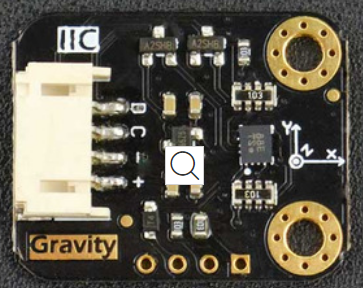

# DFRobot_BMI160

* [中文](./README_CN.md)

The BMI160 is a highly integrated, low power inertial measurement unit (IMU) that provides precise acceleration and angular rate (gyroscopic) measurement.<br>
The BMI160 contains 16 bit digtial,triaxial accelerometer and 16 bit digital, triaxial gyroscope.<br>
This example is for BMI160 sensor and it oprated via Arduino I2C.<br>



## Product Link（[https://www.dfrobot.com/product-1716.html](https://www.dfrobot.com/product-1716.html)）
    SKU: SEN0250  

## Table of Contents

* [Summary](#summary)
* [Installation](#installation)
* [Methods](#methods)
* [Compatibility](#compatibility)
* [History](#history)
* [Credits](#credits)

## Summary

Provide an Arduino library to control the bmi160 to get accel, gyro and step counter, via I2C communication.

## Installation

To use this library, first download the library file, paste it into the \Arduino\libraries directory, then open the examples folder and run the demo in the folder.

## Methods

```C++	

  /**
   * @fn I2cInit
   * @brief set the i2c addr and init the i2c.
   * @param i2c_addr  bmi160 i2c addr
   * @n     0x68: connect SDIO pin of the BMI160 to GND which means the default I2C address
   * @n     0x69: set I2C address by parameter
   * @return BMI160_OK(0) means success
   */
  int8_t I2cInit(int8_t i2c_addr = BMI160_I2C_ADDR);
  
  /**
   * @fn getSensorData
   * @brief select mode and save returned data to parameter data.
   * @param type  three type
   * @n     onlyAccel    :   only get the accel data
   * @n     onlyGyro     :   only get the gyro data
   * @n     bothAccelGyro:   get boath accel and gyro data
   * @param data  save returned data to parameter data
   * @return BMI160_OK(0) means succse
   */
  int8_t getSensorData(uint8_t type,int16_t* data);
  
  /**
   * @fn getAccelData
   * @brief get the accel data 
   * @param data pointer to store the accel data
   * @return BMI160_OK(0) means succse
   */
  int8_t getAccelData(int16_t* data);
  
  /**
   * @fn getGyroData
   * @brief get the gyro data 
   * @param data pointer to store the gyro data
   * @return BMI160_OK(0) means succse
   */
  int8_t getGyroData(int16_t* data);
  
  /**
   * @fn getAccelGyroData
   * @brief get the accel and gyro data 
   * @param data pointer to store the accel and gyro data
   * @return BMI160_OK(0) means succse
   */
  int8_t getAccelGyroData(int16_t* data);

  /**
   * @fn softReset
   * @brief reset bmi160 hardware
   * @return BMI160_OK(0) means success
   */
  int8_t softReset();
  
  /**
   * @fn setInt
   * @brief set interrupt number and choosing step detector interrupt
   * @param intNum choose int1 or int2
   * @return BMI160_OK(0) means succse
   */
  int8_t setInt(int intNum);
  
  /**
   * @fn setStepCounter
   * @brief enable the step counter
   * @return BMI160_OK(0) means succse
   */
  int8_t setStepCounter();
  
  /**
   * @fn readStepCounter
   * @brief read the step counter from bmi160
   * @param stepVal pointer to store the step 
   * @return BMI160_OK(0) measn succse
   */
  int8_t readStepCounter(uint16_t *stepVal);
  /**
   * @fn setStepPowerMode
   * @brief set the step power model
   * @param model type of model 
   * @return BMI160_OK(0) measn succse
   */
  int8_t setStepPowerMode(uint8_t model);

```

## Compatibility

MCU                | Work Well    | Work Wrong   | Untested    | Remarks
------------------ | :----------: | :----------: | :---------: | -----
FireBeetle-ESP32   |      √       |              |             | 
FireBeetle-ESP8266 |      √       |              |             | 
Arduino uno        |      √       |              |             | 


## History

- 2017-12-01 - Version 1.0.0 released.


## Credits

Written by DFRobot_haoJ(hao.jiang@dfrobot.com), 2017. (Welcome to our [website](https://www.dfrobot.com/))


